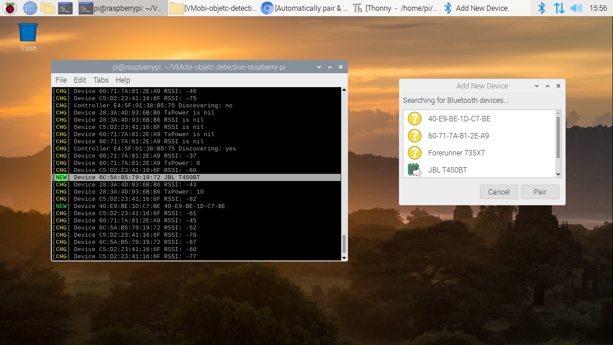

<h1>VMobi</h1>

This project is a fork from [this github](https://github.com/EdjeElectronics/TensorFlow-Lite-Object-Detection-on-Android-and-Raspberry-Pi).

---------------
<h1>Table of Contents</h1>

- [Context](#context)
- [Scope of the project](#scope-of-the-project)
- [Hardware](#hardware)
- [Installing the raspbian OS](#installing-the-raspbian-os)
- [Getting Headphone's MAC address](#getting-headphones-mac-address)
- [Installing VMobi Software](#installing-vmobi-software)
- [Usage](#usage)

--------------

Context
===========

The VMobi is a edge computing solution created to help visual impaired people on daily challenges, such as walking on the street and dodge any possible danger on the way, finding specific objects, etc.

The project is built to run on a Raspberry Pi 4 model B, capture images from the webcam, process it using the Neural Network _MobileNet SSD v2_ accelerated using the Google Coral TPU connected on the USB 3.0 Hub. It also uses Transfer Learning Networks based on the same Neural Network and they can be trained on [`this google collab notebook`](https://drive.google.com/file/d/1byyGspm0q2N7z_AErVBGIZ0rbHX7VEDG/view?usp=sharing).

This project is being developed by a team at Insper, São Paulo, Brasil, alongside with Prof. Kamal Sarkar at UTRGV, Texas, USA.

Scope of the project
============

The VMobi has two different implemented modes:

- Safari Mode
    
    This mode runs natively and only stops when the query mode is called. It uses the _MobileNet SSD v2_ network to detect any possible danger on the way and it alerts the user if so.

- Query Mode

    The Query Mode works as a query made by the user and the software starts processing the frames of the webcam with the corresponding model to the chosen object/category and alert if it finds any correspondence, returning after it's end to the safari mode.

Hardware
=========

- Raspberry Pi 4 Model B
- WebCam (USB)
- EarPhones/HeadPhones (Bluetooth)
- Google Coral TPU (USB)
- GPIO Hardware:
  - Protoboard
  - 3 Simple Buttons
  - At least 7 jumpers

The main _hardware_ is the Raspberry Pi 4 Model B, all other pieces are connected to it.

> Diagram of the Hardware Connections


Installing the raspbian OS
===========================

This project was made to use the [`Hardware`](#hardware) mentioned on the topic above and the raspbian as the operating system.

First, download the raspbian OS on any computer: https://downloads.raspberrypi.org/raspios_armhf/images/raspios_armhf-2021-05-28/2021-05-07-raspios-buster-armhf.zip

Insert the SD card on the computer and run the following command on the same directory of the dowloaded image file:

```sh
$ sudo time dd if=2021-05-07-raspios-buster-armhf.img of=/dev/mmcblk0 bs=4M conv=sync,noerror status=progress
```

Now you recorded the OS to an SD Card. By this you can eject the SD card and put it on the Raspberry Pi 4.

Getting Headphone's MAC address
==========================
On the Raspberry Pi 4:

Make sure what is your Headphones' MAC address. To do that open a new terminal (CTRL+ALT+T) and write:
```bash
bluetoothctl scan on
```


Get your device's MAC address (XX:XX:XX:XX:XX:XX) and save it, we will use it in the next steps.

Installing VMobi Software
==========================

On the Raspberry Pi 4:

Make sure you have Python version >= 3.7:

```sh
$ which python3
$ python3 --version
```

> Both commands above must return a valid output indicating the python3 version. If it shows an error or nothing, you should install python3

To install python3, in case you don't have it:

```sh
$ sudo apt update
$ sudo apt install python3-pip
```

Then, run:

```sh
$ git clone https://github.com/pfeinsper/VMobi-objetc-detection-raspberry-pi
$ cd VMobi-objetc-detection-raspberry-pi
$ sudo chmod +x install.sh
```

Now, edit the btconnection.sh file updating with the MAC address that you saved in the last step:


And, without the Google Coral TPU connected to the hardware, run:
```
$ sudo su
$ ./install.sh
```

> Disclaimer: At the end of the script, your raspberry pi should reboot.

To use other models, download the `.tflite` file and move it to a new folder in the root directory of the project, named `'{Model Name}_model'` (Change `Model Name`).

Verify if cronjob was set:
```bash
crontab -e
```
You should see in the last line:
```bash
@reboot ./Vmobi-objetc-detection-raspberry-pi/btconnetion.sh
```
If it won't there, add that line in the end of the file and save it.


Usage
======

The project is built to run as root, so run first:

```sh
$ sudo su
```

Now that you have a root shell, conect the Google Coral TPU on the USB 3.0 input and then, in the root directory of the project, run:

```sh
$ python3 main.py --modeldir={Name of the Model Directory} --edgetpu
```

> Note: You can also pass as an argument the resolution of the video with `'--resolution={Resolution Value}'` at the end of the previous command. By default, this resolution has a value of `1280x720`.
